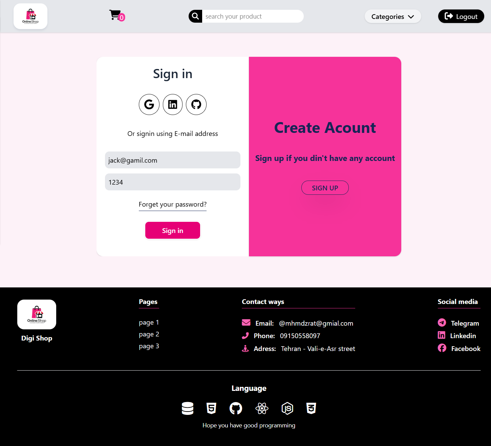
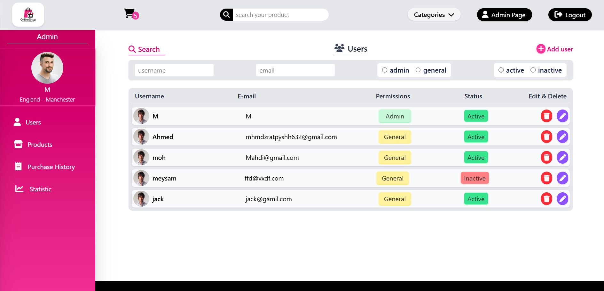
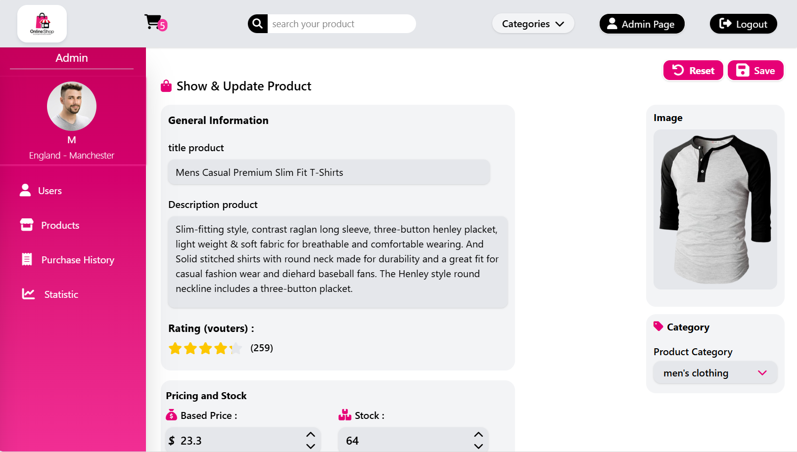
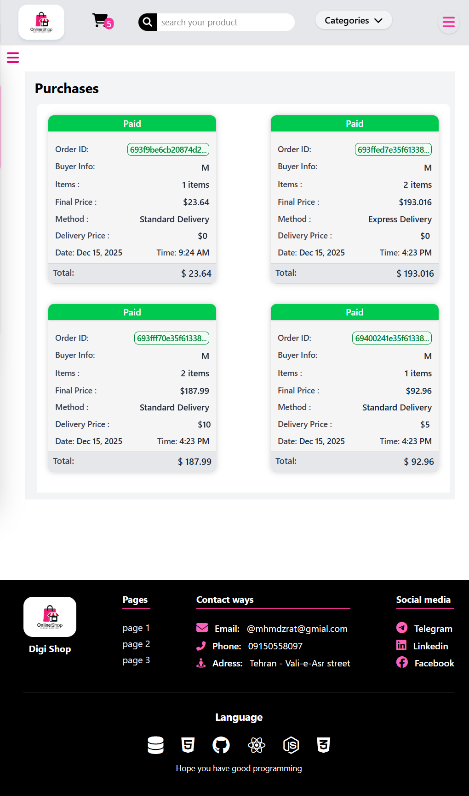

# Digi Shop
A shopping web application built with **React** and **Node.js**. Products data fetched from an API.
You can added product to the cart, increment quantities, remove items, and complete checkout for all items in the cart. If you are admin you can enter to admin dashboard
and see all of users and products and you can edit these. Also you can see all of purchases that created when a user buy some products.
Also this site has very good responsive design for laptop, tablet and mobile.

## Preview

### - Home

###  - Signin

### - Users details

### - Product details

### - Cart

### - Users details in tighter width

### - Purchases in tigher width

## Features
- Display **products detail** based on categories
- **Admin dashboard** for display all of users, products, and purchases and change them
- **Cart** for add, remove, increment count, clear and show summery
- **Summery** for show details of prices, get discount, and checkout process
- **responsiveness** for laptop and tighter widths.

## Technology used
- **React.js**
- **Tailwind CSS**
- **CSS5**
- **Node.js** (Proxy Server)

## API Info
Data provided by [Fake Store Api](https://fakestoreapi.com/products)
